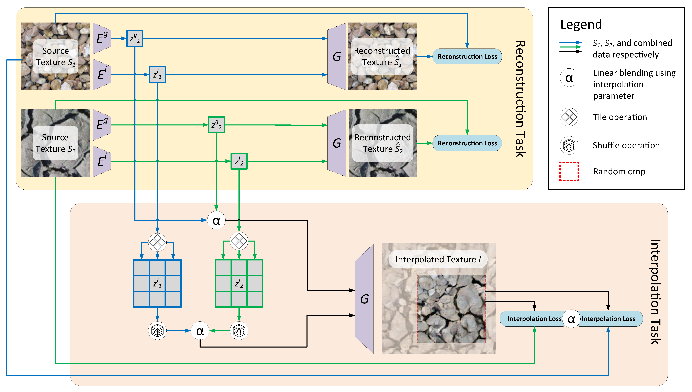

# TextureMixer

 

- Tensorflow implementation for our [CVPR'19 paper](https://arxiv.org/pdf/1901.03447.pdf) on controllable texture interpolation and several applications.
- Contact: Ning Yu (ningyu AT umd DOT edu)

## Texture Interpolation 128x1024 (more results are shown in the [paper](https://arxiv.org/pdf/1901.03447.pdf))


## Texture Dissolve 1024x1024


## Texture Brush 512x2048


## Animal hybridization


## Prerequisites
- Linux
- NVIDIA GPU + CUDA + CuDNN
- Python 3.6
- tensorflow-gpu
- Other Python dependencies: numpy, scipy, moviepy, Pillow, skimage, lmdb, opencv-python, cryptography, h5py, six
- Clone the [official VGG repository](https://github.com/machrisaa/tensorflow-vgg) into the current direcotory.

## Datasets: Animal Texture, Earth Texture, Plant Texture
- Raw training and testing images are saved at:
  - `datasets/animal_texture/`
  - `datasets/earth_texture/`
  - `datasets/plant_texture/`
  - Modify `datasets/data_augmentation.py` for data augmentation: color histogram matching (only for earth texture) --> geometric transformation --> 128x128 cropping. 
  - Follow the [official Progressive GAN repository](https://github.com/tkarras/progressive_growing_of_gans) "Preparing datasets for training" Section for our dataset preparation. Use the `create_from_images` option in `dataset_tool.py`. The prepared data enables efficient streaming.
- For convenience, the prepared testing datasets can be downloaded from:
  - [Animal texture](https://drive.google.com/file/d/15HGHJuEMMbaUPMyH23iQrru0teH1gJmw/view?usp=sharing)
  - [Earth texture](https://drive.google.com/file/d/1A08JnZEUJGAFuLkhYtkqz7t9qnjMjVVj/view?usp=sharing)
  - [Plant texture](https://drive.google.com/file/d/1HPTOc_10Uz1BXQK8_GrS0y9hEjnaBz-0/view?usp=sharing)
  - Unzip and put under `datasets/`.

## Pre-Trained Models
- The pre-trained TextureMixer models can be downloaded from:
  - [Animal texture](https://drive.google.com/file/d/1zTRwT5W8ExfnPRUZQ5kcu70c_BYzT9u2/view?usp=sharing)
  - [Earth texture](https://drive.google.com/file/d/1ObAFBPGaRJFo11LUa0qNhRX14nTEWKC1/view?usp=sharing)
  - [Plant texture](https://drive.google.com/file/d/1lAMZyXy9wYzAjseeBLw6XWq1XY9FE9SV/view?usp=sharing)
  - Unzip and put under `models/`.

## Applications
### Texture Interpolation
E.g., run
```
python3 run.py \
--app interpolation \
--model_path models/animal_texture/network-final.pkl \
--imageL_path examples/animal_texture/1000_F_99107656_XvbvoVVRintE5tmuh1MkdXqs8rkzoahB_NW_aug00000094.png \
--imageR_path examples/animal_texture/1000_F_109464954_aBfyWSbdZt5PNpUo7hOqDRPWmmvQj3v9_NW_aug00000092.png \
--out_dir results/animal_texture/horizontal_interpolation/
```
where
- `imageL_path`: The left-hand side image for horizontal interpolation.
- `imageR_path`: The right-hand side image for horizontal interpolation.
### Texture Dissolve
E.g., run
```
python3 run.py \
--app dissolve \
--model_path models/animal_texture/network-final.pkl \
--imageStartUL_path examples/animal_texture/1000_F_23745067_w0GkcAIQG2C4hxOelI1aQYZglEXggGRS_NW_aug00000000.png \
--imageStartUR_path examples/animal_texture/1000_F_44327602_E6wl8FNihQON8c704fE5DEY2LOJPQQ1V_NW_aug00000018.png \
--imageStartBL_path examples/animal_texture/1000_F_66218716_rxcsXWQzYpIWVB8a09ZcuNzE7qAJ3HEk_NW_aug00000098.png \
--imageStartBR_path examples/animal_texture/1000_F_40846588_APKTS3BpiRvR1nvUx0FRa7qjjR788zt8_NW_aug00000001.png \
--imageEndUL_path examples/animal_texture/1000_F_40300952_3dgaCtcLCrhzU0r6HEfnwr7nujDWXbSQ_NW_aug00000029.png \
--imageEndUR_path examples/animal_texture/1000_F_44119648_3vskjRwVc4NVT1Pf0l3RlvIFUemo8TM1_NW_aug00000001.png \
--imageEndBL_path examples/animal_texture/1000_F_70708482_2N8lknTCJg2Q8JQeomFYaFttxId9rulj_NW_aug00000070.png \
--imageEndBR_path examples/animal_texture/1000_F_79496236_8mxTSHy5OilHnJaAxWcw2dwC9SoBLmDK_NW_aug00000057.png \
--out_dir results/animal_texture/dissolve/
```
where
- `imageStartUL_path`: The upper-left corner image in the starting frame.
- `imageStartUR_path`: The upper-right corner image in the starting frame.
- `imageStartBL_path`: The bottom-left corner image in the starting frame.
- `imageStartBR_path`: The bottom-right corner image in the starting frame.
- `imageEndUL_path`: The upper-left corner image in the ending frame.
- `imageEndUR_path`: The upper-right corner image in the ending frame.
- `imageEndBL_path`: The bottom-left corner image in the ending frame.
- `imageEndBR_path`: The bottom-right corner image in the ending frame.
### Texture Brush
E.g., run
```
python3 run.py \
--app brush \
--model_path models/animal_texture/network-final.pkl \
--imageBgUL_path examples/animal_texture/1000_F_23745067_w0GkcAIQG2C4hxOelI1aQYZglEXggGRS_NW_aug00000000.png \
--imageBgUR_path examples/animal_texture/1000_F_44327602_E6wl8FNihQON8c704fE5DEY2LOJPQQ1V_NW_aug00000018.png \
--imageBgBL_path examples/animal_texture/1000_F_66218716_rxcsXWQzYpIWVB8a09ZcuNzE7qAJ3HEk_NW_aug00000098.png \
--imageBgBR_path examples/animal_texture/1000_F_40846588_APKTS3BpiRvR1nvUx0FRa7qjjR788zt8_NW_aug00000001.png \
--imageFgUL_path examples/animal_texture/1000_F_40300952_3dgaCtcLCrhzU0r6HEfnwr7nujDWXbSQ_NW_aug00000029.png \
--imageFgUR_path examples/animal_texture/1000_F_44119648_3vskjRwVc4NVT1Pf0l3RlvIFUemo8TM1_NW_aug00000001.png \
--imageFgBL_path examples/animal_texture/1000_F_70708482_2N8lknTCJg2Q8JQeomFYaFttxId9rulj_NW_aug00000070.png \
--imageFgBR_path examples/animal_texture/1000_F_79496236_8mxTSHy5OilHnJaAxWcw2dwC9SoBLmDK_NW_aug00000057.png \
--stroke1_path stroke_fig/C_skeleton.png \
--stroke2_path stroke_fig/V_skeleton.png \
--stroke3_path stroke_fig/P_skeleton.png \
--stroke4_path stroke_fig/R_skeleton.png \
--out_dir results/animal_texture/brush/
```
where
- `imageBgUL_path`: The upper-left corner image for the background canvas.
- `imageBgUR_path`: The upper-right corner image for the background canvas.
- `imageBgBL_path`: The bottom-left corner image for the background canvas.
- `imageBgBR_path`: The bottom-right corner image for the background canvas.
- `imageFgUL_path`: The upper-left corner image for the foreground palatte.
- `imageFgUR_path`: The upper-right corner image for the foreground palatte.
- `imageFgBL_path`: The bottom-left corner image for the foreground palatte.
- `imageFgBR_path`: The bottom-right corner image for the foreground palatte.
- `stroke1_path`: The trajectory image for the 1st stroke. The stroke pattern is sampled from the (3/8, 3/8) portion of the foreground palatte.
- `stroke2_path`: The trajectory image for the 2nd stroke. The stroke pattern is sampled from the (3/8, 7/8) portion of the foreground palatte.
- `stroke3_path`: The trajectory image for the 3rd stroke. The stroke pattern is sampled from the (7/8, 3/8) portion of the foreground palatte.
- `stroke4_path`: The trajectory image for the 4th stroke. The stroke pattern is sampled from the (7/8, 7/8) portion of the foreground palatte.
### Animal hybridization
E.g., run
```
python3 run.py \
--app hybridization \
--model_path models/animal_texture/network-final.pkl \
--source_dir hybridization_fig/leoraffe/ \
--out_dir results/animal_texture/hybridization/leoraffe/
```
where
- `source_dir`: The directory containing the hole region to be interpolated, two known source texture images adjacent to the hole, and their global Adobe Content-Aware Fill (CAF) operation results.
After that, post-process the output hybridization image by aligning (alpha-blending) it with the original image (with hole) in Photoshop, so as to achieve the demo quality shown above. 
## Citation
```
@inproceedings{yu2019texture,
    author = {Yu, Ning and Barnes, Connelly and Shechtman, Eli and Amirghodsi, Sohrab and Lukáč, Michal},
    title = {Texture Mixer: A Network for Controllable Synthesis and Interpolation of Texture},
    booktitle = {IEEE Conference on Computer Vision and Pattern Recognition (CVPR)},
    year = {2019}
}
```
## Acknowledgement
- This research is supported by Adobe Research Funding.
- We acknowledge the Maryland Advanced Research Computing Center for providing computing resources.
- We thank to the photographers for licensing photos under Creative Commons or public domain.
- We express gratitudes to the [Progressive GAN repository](https://github.com/tkarras/progressive_growing_of_gans) as we benefit a lot from their code.

## Note
- It is for non-commercial research purpose only. Adobe has been filing a patent for this work.
