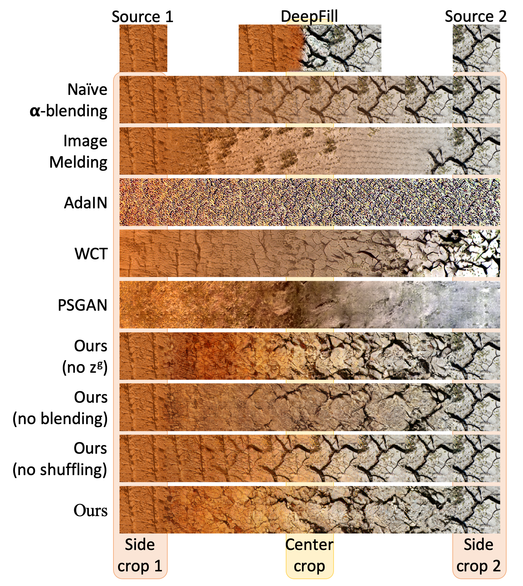
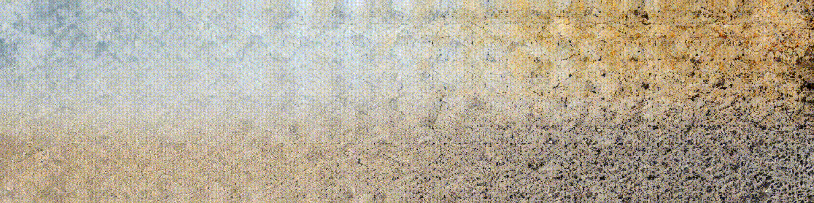
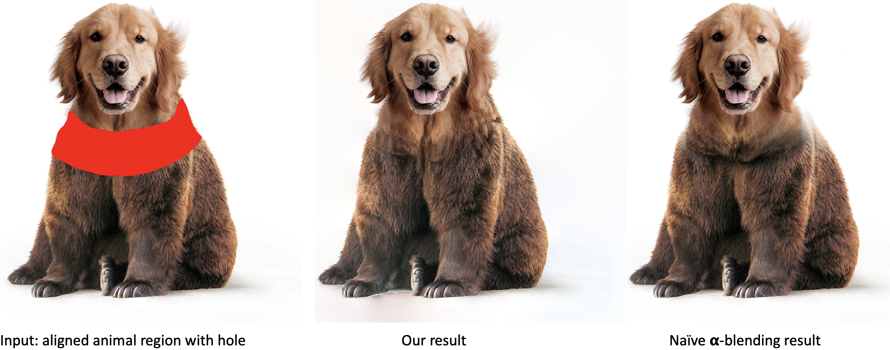
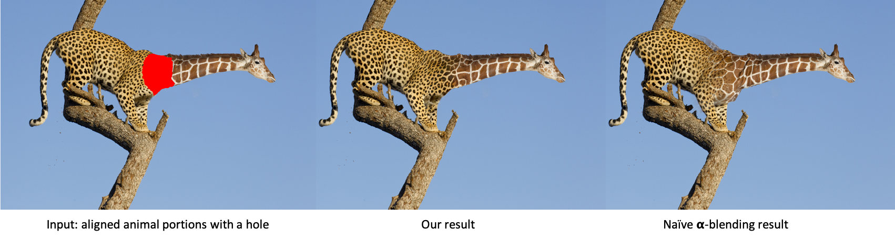
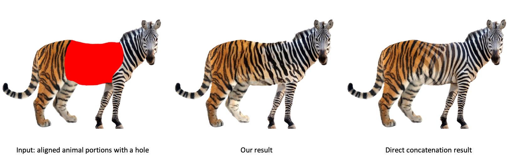

# TextureMixer


- Tensorflow implementation for our [CVPR'19 paper](https://arxiv.org/pdf/1901.03447.pdf) on controllable texture interpolation and several applications.
- Contact: Ning Yu (ningyu AT umd DOT edu)

## Texture Interpolation 128x1024 (more results are shown in the [paper](https://arxiv.org/pdf/1901.03447.pdf))


## Texture Dissolve 1024x1024


## Texture Brush 512x2048




## Animal hybridization




## Prerequisites
- Linux
- NVIDIA GPU + CUDA + CuDNN
- Python 3.6
- tensorflow-gpu
- Other Python dependencies: numpy, scipy, moviepy, Pillow, skimage, lmdb, opencv-python, cryptography, h5py, six
- Clone the [official VGG repository](https://github.com/machrisaa/tensorflow-vgg) into the current direcotory

## Dataset
- Training image addresses and seven defect severity ground truth are in the file `data/train/defect_training_gt.csv`.
- Testing image addresses and seven defect severity ground truth are in the file `data/test/defect_testing_gt.csv`.

## Network Architectures (visualize from [ethereon](http://ethereon.github.io/netscope/quickstart.html))
- Multi-column holistic-input GoogLeNet is in the file `prototxt/GoogLeNet/holistic/deploy_holistic.prototxt`.
- Multi-column patch-input GoogLeNet is in the file `prototxt/GoogLeNet/patch/deploy_patch.prototxt`.

## Pre-trained Models
- [Multi-column holistic-input GoogLeNet model](https://drive.google.com/file/d/1rW_ZmRXQasjiGt9gCAKBn7xpG_7GgnMR/view?usp=sharing) (download and put it under `model/GoogLeNet/`)
- [Multi-column patch-input GoogLeNet model](https://drive.google.com/file/d/1xsx2aRc-PIscKTMWzjWOHCkCyG0h-0vA/view?usp=sharing) (download and put it under `model/GoogLeNet/`)

## Infogain Weights
- If users launch their own training or testing with the [infogain loss](http://caffe.berkeleyvision.org/doxygen/classcaffe_1_1InfogainLossLayer.html) as Eq. 1 in our [paper](https://arxiv.org/pdf/1612.01635.pdf), they can use our pre-computed weights at `data/infogain_mat/`, which follows the formulation as Eq. 4 in our [supplemental material](https://drive.google.com/file/d/1J3suq5UnSjCZGEkrqCHTnKUPlg505p7f/view?usp=sharing).

## Testing
- First download testing images from the addresses in the first column in the file `data/test/defect_testing_gt.csv` into `data/test/original_resolution/`.
  Or put customized images into that directory.
- Then run
```
python test.py -iPath data/test/original_resolution -oPath output/GoogLeNet -holisticDeployPath prototxt/GoogLeNet/holistic/deploy_holistic.prototxt -holisticWeightsPath model/GoogLeNet/weights_holistic.caffemodel -patchDeployPath prototxt/GoogLeNet/patch/deploy_patch.prototxt -patchWeightsPath model/GoogLeNet/weights_patch.caffemodel -gpu 0
```
- The final seven defect severity prediction results are saved in the file `output/GoogLeNet/defect_scores_combined.csv`.
- Testing images are sorted in the descent order according to each defect severity prediction and visualized correspondingly to the file `output/GoogLeNet/defect_scores_combined_*.html`.

## Evaluation
- We use the cross-class ranking correlation (proposed in Section 3.2 in our [paper](https://arxiv.org/pdf/1612.01635.pdf)) to evaluate the testing results. 
- Assuming the rows and columns of `data/test/defect_testing_gt.csv` and `output/GoogLeNet/defect_scores_combined.csv` align to each other, run
```
python evaluate.py -gtPath data/test/defect_testing_gt.csv -predPath output/GoogLeNet/defect_scores_combined.csv -oPath output/GoogLeNet
```
- The evaluation measures are saved in the file `output/GoogLeNet/evaluation.csv`.

## Citation
```
@inproceedings{yu2018learning,
    author = {Yu, Ning and Shen, Xiaohui and Lin, Zhe and Měch, Radomír and Barnes, Connelly},
    title = {Learning to Detect Multiple Photographic Defects},
    booktitle = {IEEE Winter Conference on Applications of Computer Vision (WACV)},
    year = {2018}
}
```
## Acknowledgement
- This research is supported by Adobe Research Funding.
- We thank to the photographers for licensing photos under Creative Commons or public domain.
- We express gratitudes to the popular [caffe-googlenet-bn](https://github.com/lim0606/caffe-googlenet-bn) repository as we benefit a lot from their code.

## Note
- It is for non-commercial research purpose only. Adobe has been filing a patent for this work.
